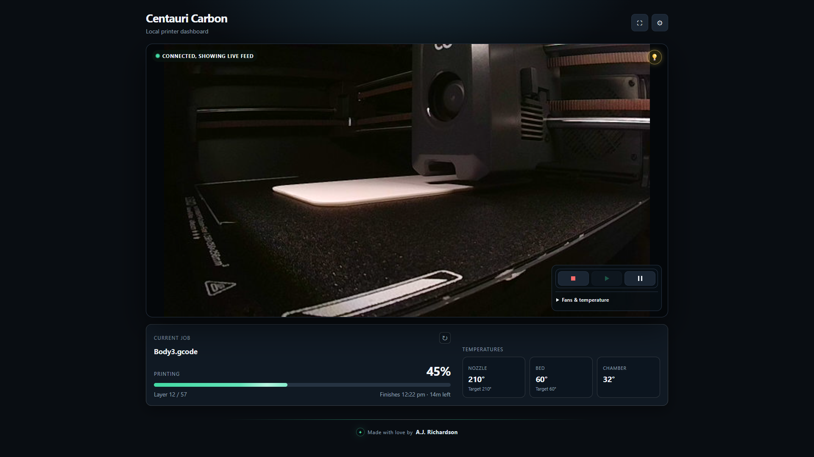

# Centauri Carbon Dashboard

A local browser dashboard for Centauri Carbon (CC1) and Centauri Carbon 2 (CC2) printers. View live cameras, print progress, layers, time estimates, and temperatures; control lights, fans, temperatures, and pause/stop/resume. Monitor either printer or both together.

Plain HTML, CSS, and JavaScript—no build step or cloud account required. File uploads, starting new prints, and Canvas tray management are not supported. CC2 support has been tested with simulated messages but has not yet been verified on a physical printer.


## Setup

1. Download the project, keeping all files and the `vendor` folder together.
2. Follow Docker setup below.
3. In **Settings**, select your printer model and enter its LAN IP address (without a scheme or port).
   - **CC1:** Leave **Serial Number** blank for automatic detection, or enter it manually if detection fails.
   - **CC2:** Enable **LAN Only** mode on the printer and enter its serial number and LAN access code. Firmware must support MQTT over WebSocket on port **9001**; TCP-only MQTT on port 1883 is not supported.
4. Optionally enter a custom **Camera URL**, then select **Save**.

Keep your browser and printer on the same reachable local network. Use local HTTP when hosting the dashboard; HTTPS may block the printer connections. Allow local-network access if your browser prompts.

### Docker setup

Open project folder in terminal and run the below command.

```bash
docker compose up -d
```

Open <http://localhost:8080>. Docker also provides CC1 serial-number discovery over UDP port 3000. Change the host port in `docker-compose.yml` if needed. On SELinux hosts, append `:z` to both dashboard volume mounts.

Stop with `docker compose down`. After updating project files, run `docker compose up -d --force-recreate` and reload the page.

## Usage

- Configure and save each model separately, then use **CC1**, **CC2**, or **Both** to choose your view.
- Use **Fullscreen** to expand the camera and the refresh arrow to reconnect.
- Play resumes a paused job; it cannot start a new print.
- In Settings, enable **Lock temperatures during a print** or **Lock fans during a print** to prevent changes during active or paused jobs.

Settings are saved in the current browser, including the CC2 access code in plain text. Clear this site's browser data to reset them.

## Troubleshooting

- **Cannot connect:** Check the printer's power, IP address, serial number, and network/firewall access. For CC2, also check LAN Only mode and the access code.
- **CC1 serial number not detected:** Wake the printer and reconnect, use Docker for UDP discovery, or enter the serial number manually.
- **Camera unavailable:** Enable the printer camera and try the default stream directly, or set a custom Camera URL. The LIVE badge indicates the status connection, not camera health.

## Development

Run protocol checks with Node.js:

```bash
node --test tests/protocol.test.cjs
```

These tests simulate printer communication without contacting hardware.

## Credits and license

Made by A.J. Richardson. Licensed under [MIT](LICENSE).

CC2 references: [Elegoo SDK](https://github.com/elegooofficial/elegoo-link/tree/main/src/lan/adapters/elegoo_fdm_cc2) and [protocol notes](https://github.com/bjan/pycentauri/blob/main/docs/PROTOCOL.md#centauri-carbon-2-cc2-protocol-notes).

Includes [MQTT.js](https://github.com/mqttjs/MQTT.js) 5.14.1; its [MIT license](vendor/MQTT-LICENSE.md) is bundled locally.